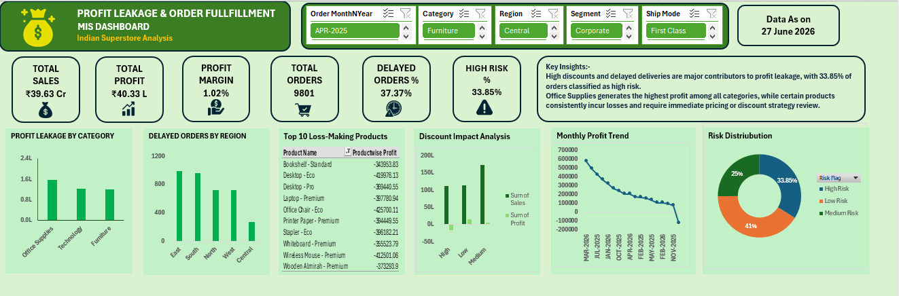

# Profit Leakage & Order Fulfillment MIS Dashboard

## Project Overview

This project presents an interactive MIS Dashboard developed in Microsoft Excel to analyze profit leakage, order fulfillment performance, and business risks across categories, regions, and products.

The dashboard enables business users and management teams to monitor operational efficiency, identify profitability risks, and support data-driven decision-making.

---

## Business Objectives

* Identify categories contributing to profit leakage.
* Monitor delayed order fulfillment across regions.
* Detect loss-making products requiring corrective action.
* Analyze the impact of discounting on profitability.
* Track monthly profit performance trends.
* Highlight high-risk transactions for exception reporting.

---

## Key Performance Indicators (KPIs)

* Total Sales
* Total Profit
* Profit Margin %
* Total Orders
* Delayed Orders %
* High Risk Orders %

---

## Dashboard Features

### 1. Profit Leakage Analysis

Analyzes profitability across product categories to identify areas contributing to revenue leakage.

### 2. Delayed Orders Analysis

Monitors regional order fulfillment delays to improve operational efficiency.

### 3. Top 10 Loss-Making Products

Highlights products generating the highest losses for management review.

### 4. Discount Impact Analysis

Evaluates the relationship between discount levels and profitability.

### 5. Monthly Profit Trend

Tracks month-over-month profit performance.

### 6. Risk Distribution Analysis

Categorizes transactions into High, Medium, and Low Risk segments.

---

## Exception Reporting

The dashboard includes exception reporting logic to identify:

* High-risk orders
* Delayed deliveries
* Loss-making transactions

---

## Tools & Technologies Used

* Microsoft Excel
* Pivot Tables
* Pivot Charts
* Slicers
* Advanced Excel Formulas
* Conditional Formatting
* Dashboard Design
* MIS Reporting

---

## Excel Functions Used

```excel
IF()
TEXT()
DATE()
AND()
```

---

## Dashboard Preview



---

## Key Insights

* High discounts and delayed deliveries are major contributors to profit leakage.
* A significant proportion of orders are classified as high risk and require management attention.
* Certain products consistently generate losses and require pricing strategy review.
* Regional delivery delays indicate operational improvement opportunities.

---

## Project Outcome

The dashboard provides management with a centralized reporting solution for monitoring profitability, operational performance, and business risks, enabling faster and more informed decision-making.

---

## Author

**Arannayava Debnath**

Aspiring Data Analyst

LinkedIn: [https://](https://www.linkedin.com/in/arannayava-debnath-881416323)[www.linkedin.com/in/arannayava-debnath-881416323](https://www.linkedin.com/in/arannayava-debnath-881416323)

GitHub: https://github.com/aranna20
